# LAPORAN PERANCANGAN SISTEM
# Sistem Digital Wakrun

**Mata Kuliah:** Perancangan Berbasis Objek (PBO)  
**Sistem:** Digital Wakrun - Digitalisasi Warung Kopi/Kedai  
**Tanggal:** 12 Desember 2025  
**Versi:** 1.0

---

## DAFTAR ISI

1. [Pendahuluan](#1-pendahuluan)
2. [Overview Sistem](#2-overview-sistem)
3. [Diagram Behavioral](#3-diagram-behavioral)
4. [Diagram Structural](#4-diagram-structural)
5. [Kesimpulan](#5-kesimpulan)
6. [Appendix](#6-appendix)

---

## 1. PENDAHULUAN

### 1.1 Latar Belakang

Sistem Digital Wakrun dirancang untuk digitalisasi proses operasional warung kopi/kedai makanan tradisional. Sistem ini bertujuan meningkatkan efisiensi layanan, mengurangi kesalahan pemesanan, dan memberikan pengalaman yang lebih baik bagi pelanggan.

### 1.2 Tujuan Perancangan

1. Mendokumentasikan arsitektur sistem secara komprehensif
2. Menyediakan blueprint untuk implementasi
3. Memfasilitasi komunikasi antar tim development
4. Menjadi acuan untuk maintenance dan pengembangan

### 1.3 Ruang Lingkup

Perancangan mencakup 14 jenis diagram UML yang menggambarkan:
- **Behavioral Aspects:** Interaksi dan alur proses sistem
- **Structural Aspects:** Arsitektur dan organisasi komponen

---

## 2. OVERVIEW SISTEM

### 2.1 Deskripsi Sistem

Digital Wakrun adalah aplikasi web-based untuk manajemen pesanan makanan/minuman dengan fitur:
- Pemesanan digital oleh customer
- Manajemen menu oleh admin  
- Notifikasi real-time ke dapur
- Tracking status pesanan
- Integrasi payment gateway
- Laporan penjualan

### 2.2 Aktor Sistem

| Aktor | Deskripsi | Fungsi Utama |
|-------|-----------|--------------|
| **Customer** | Pelanggan yang memesan | Browse menu, order, payment |
| **Admin** | Pengelola sistem | Manage menu, konfirmasi payment, reports |
| **Dapur** | Staff kitchen | Terima notifikasi, update status masakan |
| **Payment Gateway** | Sistem eksternal | Proses pembayaran digital |

### 2.3 Teknologi Stack

- **Frontend:** HTML, CSS, Vanilla JavaScript
- **Storage:** LocalStorage (prototype), PostgreSQL (production plan)
- **Payment:** Midtrans integration (planned)
- **Real-time:** WebSocket untuk notifikasi

---

## 3. DIAGRAM BEHAVIORAL

Diagram behavioral menggambarkan perilaku dinamis sistem, interaksi antar komponen, dan alur proses bisnis.

---

### 3.1 USE CASE DIAGRAM

**Penanggung Jawab:**  
- Desainer: Ana Kusuma  
- Reviewer: Budi Santoso  
- Tanggal: 12 Desember 2025

#### Deskripsi
Use Case Diagram menggambarkan fungsionalitas sistem dari perspektif pengguna, menunjukkan aktor dan use case beserta relasinya.

#### Diagram
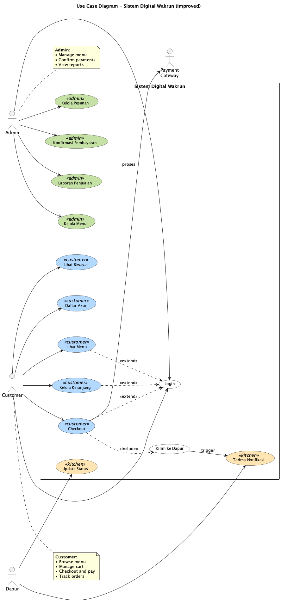

#### Komponen Utama

**Aktor:**
1. **Customer** - Pengguna yang memesan makanan
2. **Admin** - Pengelola sistem dan menu
3. **Dapur** - Staff yang memproses pesanan
4. **Payment Gateway** - Sistem pembayaran eksternal

**Use Cases Customer:**
- Login/Daftar Akun
- Lihat Menu
- Kelola Keranjang
- Checkout & Payment
- Lihat Riwayat Pesanan

**Use Cases Admin:**
- Kelola Menu (CRUD)
- Kelola Pesanan
- Konfirmasi Pembayaran
- Generate Laporan Penjualan

**Use Cases Dapur:**
- Terima Notifikasi Pesanan
- Update Status Masakan

#### Relasi Penting
- `<<extend>>` Login extends ViewMenu, Cart, Checkout
- `<<include>>` Checkout includes SendToKitchen
- Payment Gateway diakses saat Checkout

---

### 3.2 ACTIVITY DIAGRAM

**Penanggung Jawab:**  
- Desainer: Citra Dewi  
- Reviewer: Dewi Lestari  
- Tanggal: 12 Desember 2025

#### Deskripsi Overall
Activity Diagram menggambarkan alur proses bisnis dari awal hingga akhir, menunjukkan decision points, parallel processes, dan swimlanes untuk setiap aktor.

#### Diagram Overall
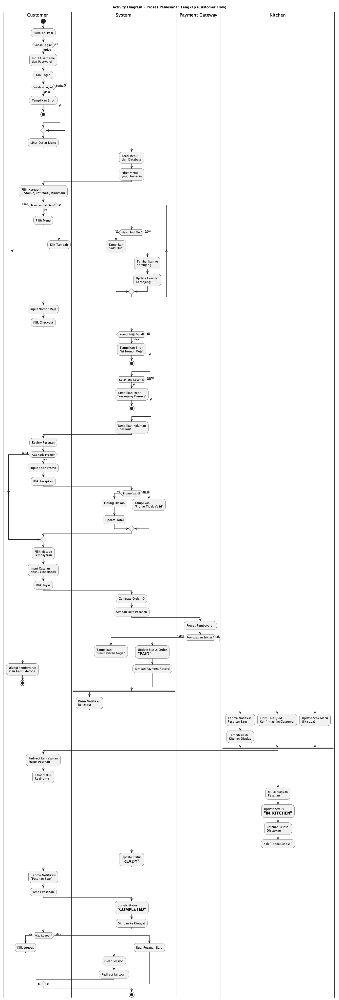

**Keterangan:** Diagram complete menunjukkan seluruh flow dari login hingga order completed. Untuk clarity, diagram dipecah menjadi 3 bagian fokus.

---

##### 3.2.1 Customer Ordering Flow

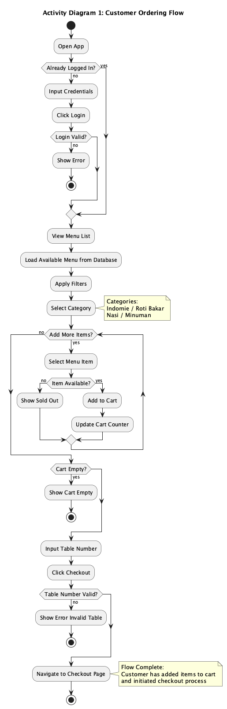

**Fokus:** Proses pemesanan dari customer perspective

**Alur Utama:**
1. Customer membuka aplikasi
2. Login (jika belum)
3. Browse menu dan pilih kategori
4. Add items ke cart (loop)
5. Input nomor meja
6. Checkout

**Decision Points:**
- Already logged in? → Skip login
- Login valid? → Proceed atau show error
- Item available? → Add to cart atau show sold out
- Cart empty? → Cannot checkout
- Table valid? → Proceed to payment

**Output:** Customer siap untuk payment di checkout page

---

##### 3.2.2 Payment Processing Flow

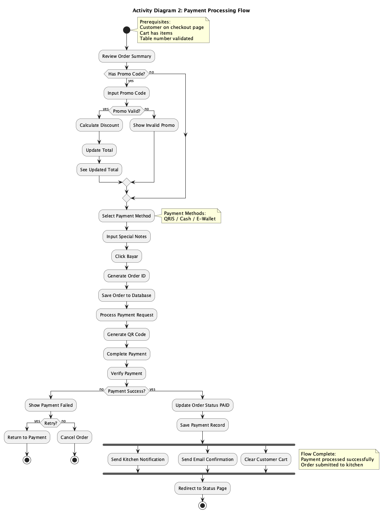

**Fokus:** Proses pembayaran dan order creation

**Alur Utama:**
1. Review order summary
2. Apply promo code (optional)
3. Select payment method
4. Generate order ID
5. Process payment via gateway
6. Verify payment
7. Send notifications (parallel: kitchen, email, cart clear)

**Decision Points:**
- Has promo? → Validate dan apply discount
- Promo valid? → Calculate new total
- Payment success? → Complete order atau retry/cancel
- Retry payment? → Back to payment atau cancel

**Output:** Order confirmed, kitchen notified, customer redirected

---

##### 3.2.3 Kitchen Processing Flow

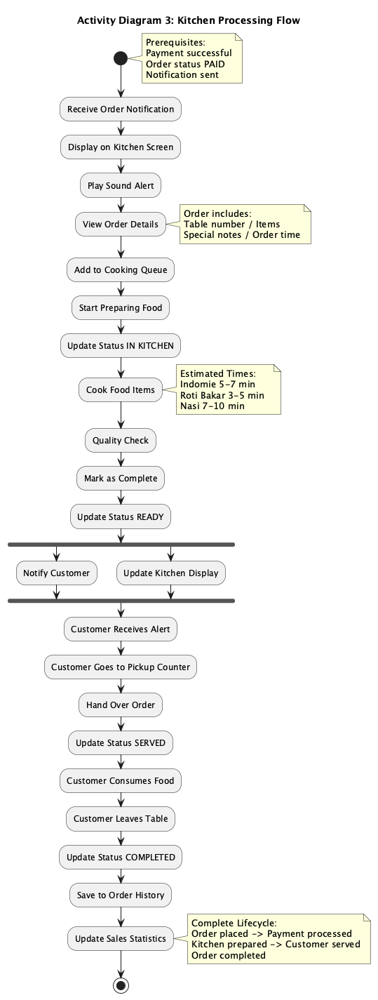

**Fokus:** Proses di dapur hingga order selesai

**Alur Utama:**
1. Dapur terima notifikasi
2. Display order di kitchen screen
3. Add to cooking queue
4. Prepare dan cook food
5. Quality check
6. Mark ready (parallel: notify customer, update display)
7. Customer pickup
8. Update status served → completed

**Paralel Actions:**
- Notify customer via push notification
- Update kitchen display status

**Final Actions:**
- Save to order history
- Update sales statistics

---

### 3.3 STATE MACHINE DIAGRAM

**Penanggung Jawab:**  
- Desainer: Eko Prasetyo  
- Reviewer: Fitri Handayani  
- Tanggal: 12 Desember 2025

#### Deskripsi
State Machine Diagram menggambarkan lifecycle sebuah Order dari dibuat hingga completed/cancelled, termasuk semua state transitions dan conditions.

#### Diagram
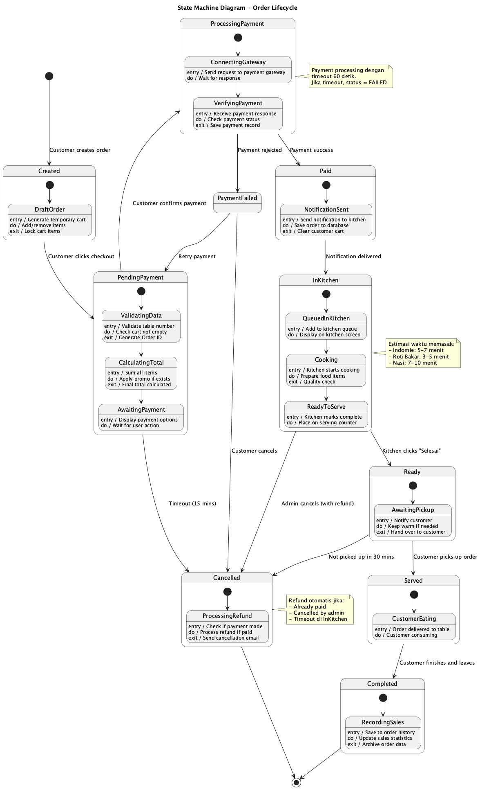

#### States Utama

| State | Description | Activities |
|-------|-------------|------------|
| **Created** | Order baru dibuat | entry: generateOrderId |
| **PendingPayment** | Menunggu pembayaran | do: displayPaymentQR, timeout: 15 min |
| **ProcessingPayment** | Payment sedang diproses | do: verifyWithGateway |
| **Paid** | Pembayaran berhasil | entry: sendKitchenNotif |
| **InKitchen** | Sedang dimasak | do: cookFood, estimatedTime: 5-10 min |
| **Ready** | Siap diambil | entry: notifyCustomer |
| **Served** | Sudah diberikan ke customer | do: customerEating |
| **Completed** | Order selesai | entry: recordSales |
| **Cancelled** | Order dibatalkan | entry: releaseTable |
| **Refunded** | Pembayaran dikembalikan | do: processRefund |

#### Transisi Important
- `Created → PendingPayment`: Customer confirms order
- `PendingPayment → ProcessingPayment`: Payment initiated  
- `ProcessingPayment → Paid [paymentSuccess]`: Payment verified
- `ProcessingPayment → PaymentFailed [!paymentSuccess]`: Payment failed
- `Paid → InKitchen`: Kitchen starts cooking
- `InKitchen → Ready`: Cooking done
- `Ready → Served`: Customer picks up
- `Served → Completed`: Customer finishes & leaves

#### Alternative Paths
- Payment timeout → Cancelled
- Payment failed & no retry → Cancelled  
- Payment failed after Paid → Refunded

---

### 3.4 SEQUENCE DIAGRAM

**Penanggung Jawab:**  
- Desainer: Gita Maharani  
- Reviewer: Hendra Wijaya  
- Tanggal: 12 Desember 2025

#### Deskripsi Overall
Sequence Diagram menggambarkan interaksi antar objek secara kronologis selama proses checkout dan pembayaran, menunjukkan message passing dan object lifetimes.

#### Diagram Overall  
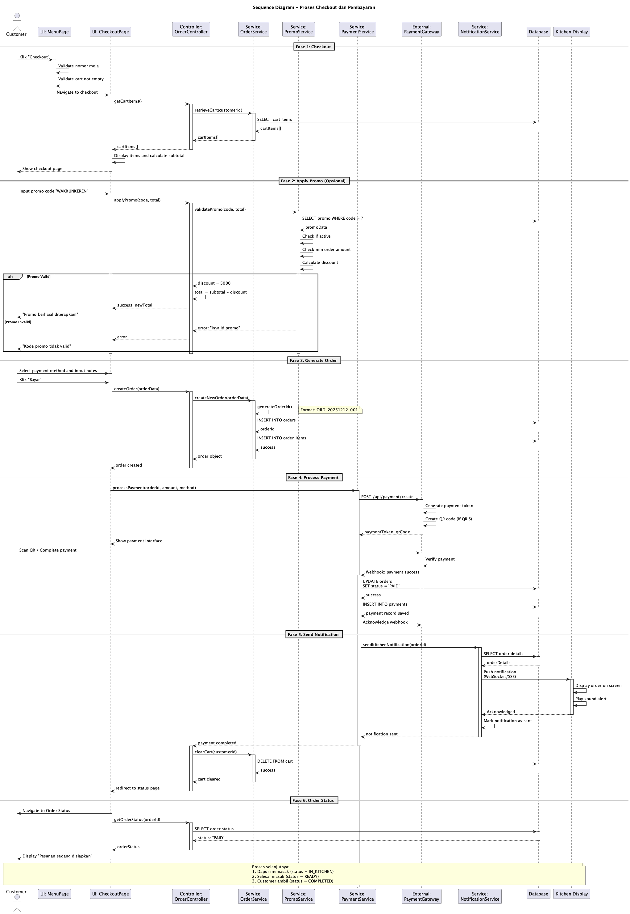

**Keterangan:** Complete sequence dari checkout hingga kitchen notification. Dipecah menjadi 5 fase untuk detail.

---

##### 3.4.1 Checkout & Cart Retrieval

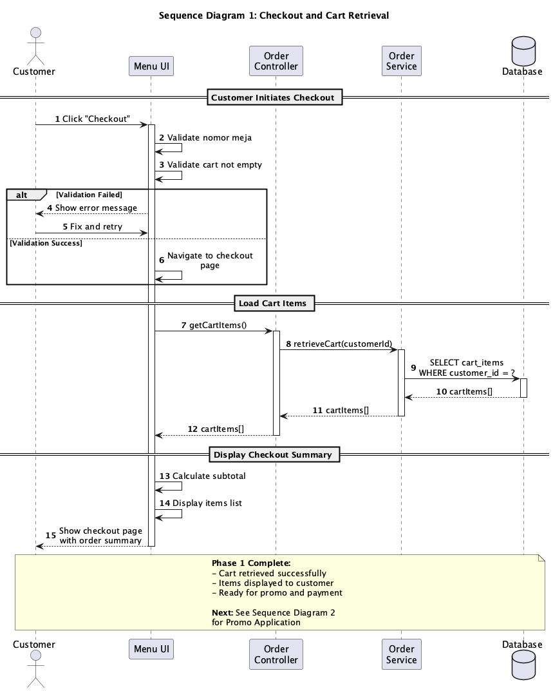

**Participants:** Customer, UI, OrderController, OrderService, Database

**Flow:**
1. Customer clicks Checkout
2. UI validates (table number, cart not empty)
3. Navigate to checkout page
4. Retrieve cart items from database
5. Calculate subtotal
6. Display checkout summary

**Messages:** 8 synchronous , 2 validation checks

---

##### 3.4.2 Promo Application

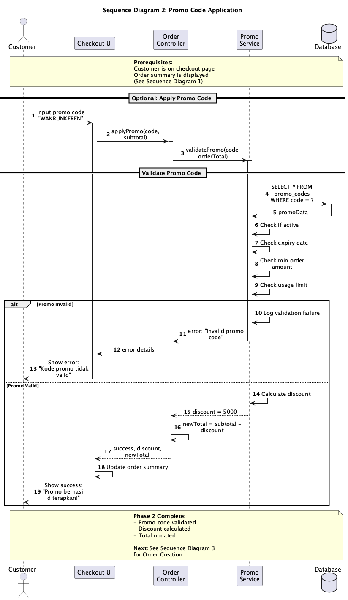

**Participants:** Customer, UI, OrderController, PromoService, Database

**Flow:**
1. Customer inputs promo code
2. Validate promo (active, not expired, min amount)
3. alt: Valid → calculate discount, update total
4. alt: Invalid → show error message

**Validation Checks:**
- Promo active status
- Expiry date
- Minimum order amount
- Usage limit

---

##### 3.4.3 Order Creation

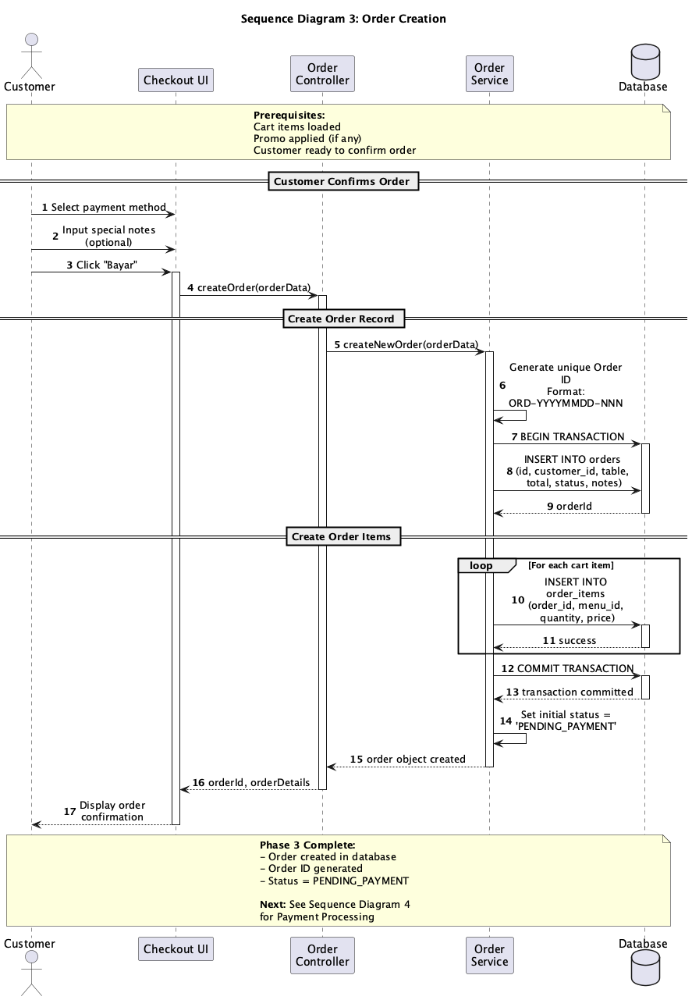

**Participants:** Customer, UI, OrderController, OrderService, Database

**Flow:**
1. Customer selects payment method & adds notes
2. Generate unique Order ID
3. Database transaction BEGIN
4. INSERT order record
5. INSERT order items (loop)
6. COMMIT transaction
7. Set status = PENDING_PAYMENT

**Transaction Safety:** All-or-nothing dengan database transaction

---

##### 3.4.4 Payment Processing

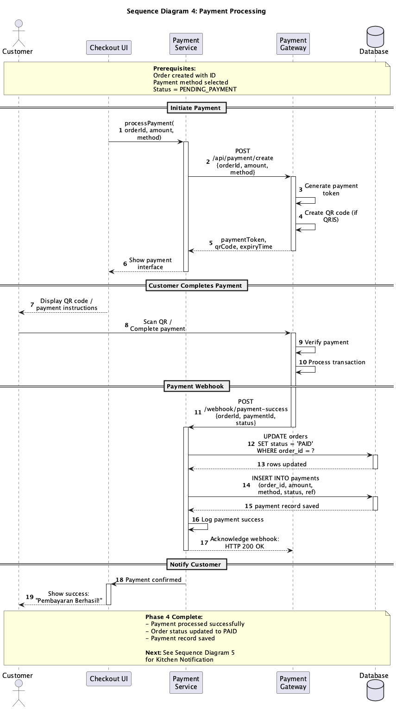

**Participants:** Customer, UI, PaymentService, PaymentGateway, Database

**Flow:**
1. Initiate payment request
2. Gateway generates payment token & QR
3. Customer completes payment
4. Gateway verifies & sends webhook
5. Update order status = PAID
6. Save payment record

**Async:** Webhook dari payment gateway handled asynchronously

---

##### 3.4.5 Kitchen Notification

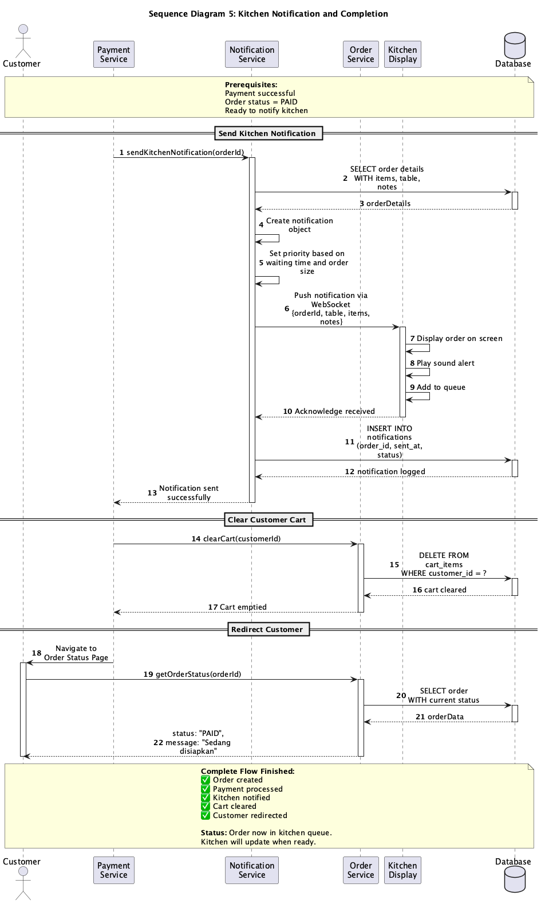

**Participants:** PaymentService, NotificationService, Database, Kitchen Display, OrderService, Customer

**Flow:**
1. Send kitchen notification with order details
2. Push via WebSocket to kitchen display
3. Kitchen acknowledges
4. Clear customer cart
5. Redirect customer to status page

**Parallel:** Notification, cart clear, dan redirect happen concurrently

---

### 3.5 COMMUNICATION DIAGRAM

**Penanggung Jawab:**  
- Desainer: Indra Gunawan  
- Reviewer: Joko Widodo  
- Tanggal: 12 Desember 2025

#### Deskripsi
Communication Diagram menunjukkan hubungan struktural antar objek dan urutan message passing menggunakan numbering 1, 2, 2.1, 2.2, dst.

#### Diagram
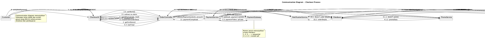

#### Object Collaboration
- Customer ↔ CheckoutUI
- CheckoutUI ↔ OrderController  
- OrderController ↔ OrderService, PromoService, PaymentService
- Services ↔ Database
- PaymentService ↔ Payment Gateway

#### Message Numbering
1. Customer initiates checkout
2. UI validates and retrieves cart
   2.1 Get cart items
   2.2 Display summary
3. Customer applies promo
   3.1 Validate promo
   3.2 Calculate discount
4. Customer confirms order
   4.1 Create order
   4.2 Process payment
      4.2.1 Generate QR
      4.2.2 Verify payment
   4.3 Send notifications

---

### 3.6 TIMING DIAGRAM

**Penanggung Jawab:**  
- Desainer: Kartika Sari  
- Reviewer: Lukman Hakim  
- Tanggal: 12 Desember 2025

#### Deskripsi
Timing Diagram menggambarkan perubahan state sistem terhadap waktu, menunjukkan sinkronisasi dan duration setiap proses.

#### Diagram
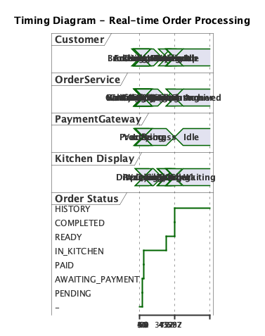

#### Timeline Analysis

| Time | Customer | OrderService | PaymentGateway | Kitchen | OrderStatus |
|------|----------|--------------|----------------|---------|-------------|
| T+0s | Checkout | Ready | Ready | Idle | - |
| T+5s | Waiting | Processing | Idle | Idle | PENDING |
| T+10s | Paying | Waiting | Processing | Idle | PENDING |
| T+30s | Paid | Completed | Completed | Notified | PAID |
| T+35s | Waiting | Idle | Idle | Cooking | IN_KITCHEN |
| T+6m | Waiting | Idle | Idle | Cooking | IN_KITCHEN |
| T+8m | Notified | Idle | Idle | Ready | READY |
| T+9m | Picking | Idle | Idle | Serving | READY |
| T+10m | Done | Idle | Idle | Idle | COMPLETED |

**Total Duration:** ~10 minutes dari checkout sampai completed

**Critical Paths:**
- Payment: 25 seconds (checkout → paid)
- Cooking: 6 minutes (paid → ready)
- Pickup: 2 minutes (ready → completed)

---

### 3.13 INTERACTION OVERVIEW DIAGRAM

**Penanggung Jawab:**  
- Desainer: Maya Puspita  
- Reviewer: Nanda Permana  
- Tanggal: 12 Desember 2025

#### Deskripsi
Interaction Overview Diagram menggabungkan activity diagram dengan sequence diagram references, menunjukkan high-level flow dengan detail interactions.

#### Diagram
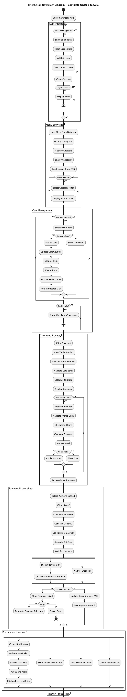

#### Flow Partitions
1. **Authentication:** Login/register
2. **Menu Browsing:** View dan select items
3. **Cart Management:** Add/update cart
4. **Checkout:** Review dan confirm
5. **Payment:** Process payment (ref: Sequence 04d)
6. **Kitchen Notification:** Send to kitchen (ref: Sequence 04e)
7. **Kitchen Processing:** Cook food
8. **Completion:** Serve dan complete

#### Referenced Diagrams
- Sequence Diagram 04d for payment detail
- Sequence Diagram 04e for notification detail  
- Activity Diagram 02c for kitchen processing

---

## 4. DIAGRAM STRUCTURAL

Diagram structural menggambarkan arsitektur statis sistem, organisasi komponen, dan relationships.

---

### 4.1 CLASS DIAGRAM

**Penanggung Jawab:**  
- Desainer: Omar Faruq  
- Reviewer: Prima Rahardja  
- Tanggal: 12 Desember 2025

#### Deskripsi Overall
Class Diagram menggambarkan struktur logis sistem dengan classes, attributes, methods, dan relationships (association, aggregation, composition, inheritance).

#### Diagram Overall
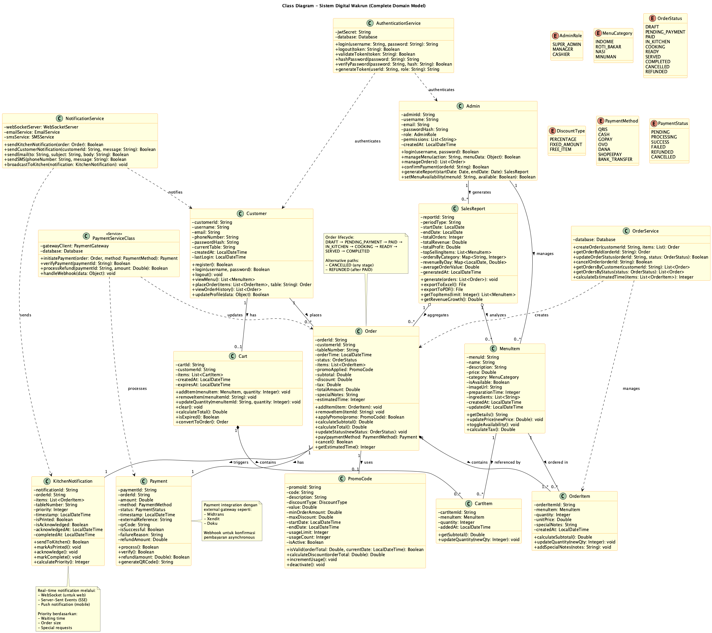

**Keterangan:** Complete domain model dengan 15+ classes. Dipecah per domain untuk clarity.

---

##### 4.1.1 Core Domain Model

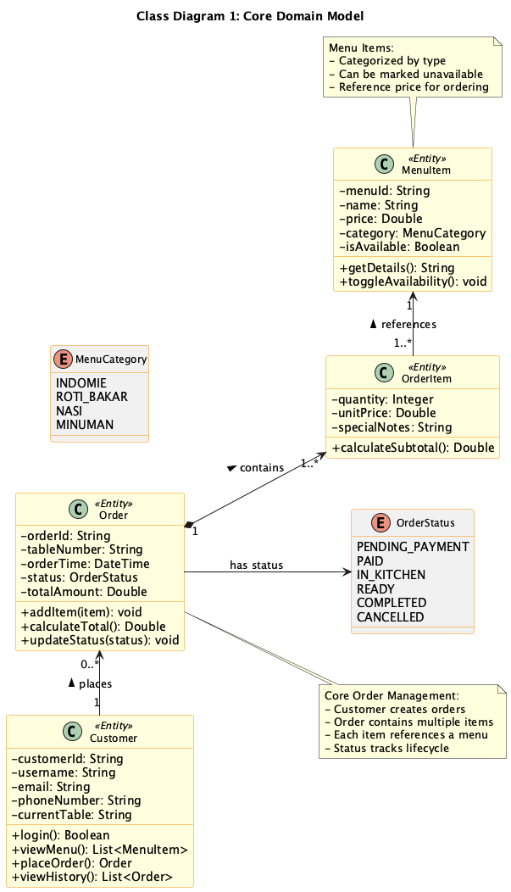

**Entities:**

**Customer**
```
- customerId, username, email, phoneNumber
+ login(), viewMenu(), placeOrder(), viewHistory()
```

**Order**
```
- orderId, tableNumber, orderTime, status, totalAmount
+ addItem(), calculateTotal(), updateStatus()
```

**OrderItem**
```
- quantity, unitPrice, specialNotes
+ calculateSubtotal()
```

**MenuItem**
```
- menuId, name, price, category, isAvailable
+ getDetails(), toggleAvailability()
```

**Relationships:**
- Customer 1 → 0..* Order
- Order 1 *→ 1..* OrderItem (composition)
- OrderItem 1..* → 1 MenuItem

---

##### 4.1.2 Payment & Promo Domain

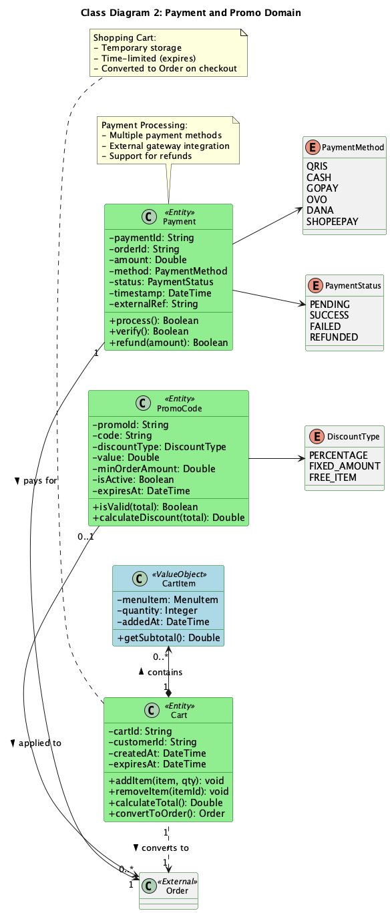

**Entities:**

**Payment**
```
- paymentId, orderId, amount, method, status, timestamp
+ process(), verify(), refund()
```

**PromoCode**
```
- promoId, code, discountType, value, minOrderAmount
+ isValid(), calculateDiscount()
```

**Cart**
```
- cartId, customerId, createdAt, expiresAt
+ addItem(), removeItem(), calculateTotal(), convertToOrder()
```

**Enums:**
- PaymentMethod: QRIS, CASH, GOPAY, OVO, DANA
- PaymentStatus: PENDING, SUCCESS, FAILED, REFUNDED
- DiscountType: PERCENTAGE, FIXED_AMOUNT, FREE_ITEM

---

##### 4.1.3 Kitchen & Notification

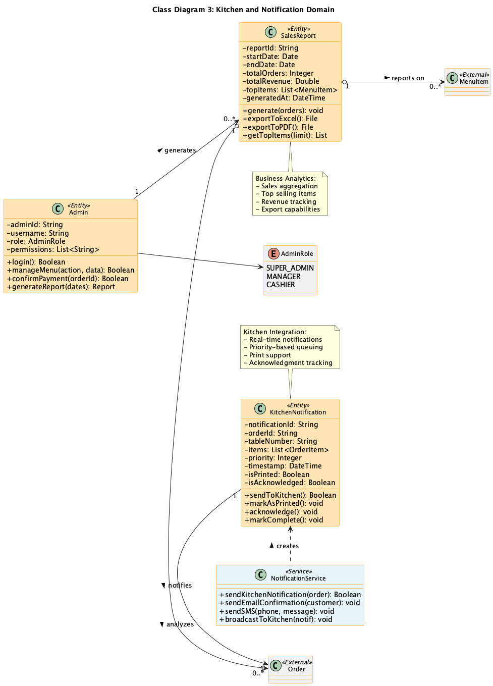

**Entities:**

**KitchenNotification**
```
- notificationId, orderId, tableNumber, items, priority
+ sendToKitchen(), markAsPrinted(), acknowledge()
```

**SalesReport**
```
- reportId, startDate, endDate, totalOrders, totalRevenue
+ generate(), exportToExcel(), exportToPDF()
```

**Admin**
```
- adminId, username, role, permissions
+ manageMenu(), confirmPayment(), generateReport()
```

---

##### 4.1.4 Service Layer

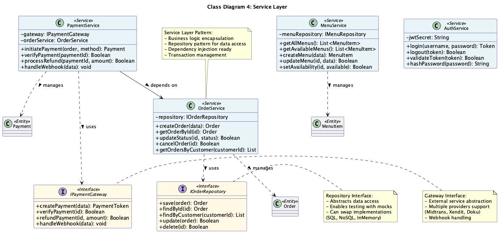

**Interfaces:**
- IOrderRepository
- IPaymentGateway
- IMenuRepository

**Services:**

**OrderService**
```
+ createOrder(), getOrderById(), updateStatus(), cancelOrder()
```

**PaymentService**
```
+ initiatePayment(), verifyPayment(), processRefund()
```

**AuthService**
```
+ login(), logout(), validateToken(), hashPassword()
```

**Pattern:** Repository and Gateway patterns untuk data access abstraction

---

### 4.2 OBJECT DIAGRAM

**Penanggung Jawab:**  
- Desainer: Qori Ananda  
- Reviewer: Rina Marlina  
- Tanggal: 12 Desember 2025

#### Deskripsi
Object Diagram menunjukkan concrete instances dari classes pada waktu tertentu, dengan actual data values.

#### Diagram
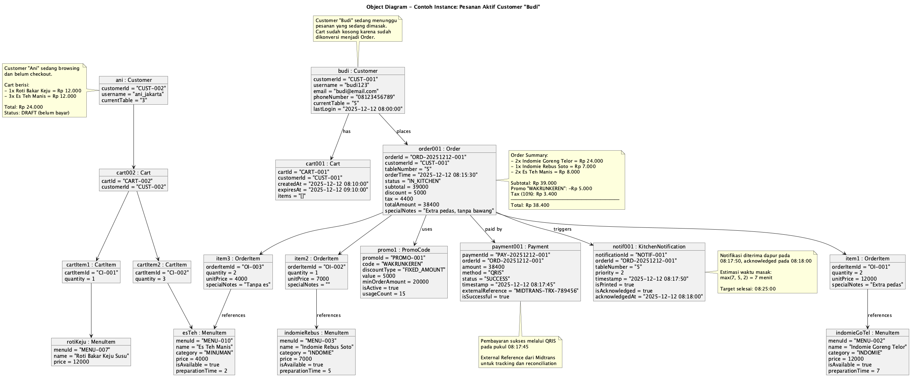

#### Scenarios

**Scenario 1: Active Order (Budi)**
```
budi:Customer {id="CUST001", name="Budi"}
  → order001:Order {id="ORD-20251212-001", status=IN_KITCHEN}
    → item001:OrderItem {qty=2, menu=indomieGoreng}
    → item002:OrderItem {qty=1, menu=tehManis}
  → payment001:Payment {amount=25000, method=QRIS, status=SUCCESS}
```

**Scenario 2: Browsing (Ani)**
```
ani:Customer {id="CUST002", name="Ani"}
  → cart001:Cart {items=3, total=45000}
    → cartItem001 {qty=1, menu=nasiGoreng}
    → cartItem002 {qty=2, menu=rotiCoklat}
```

---

### 4.3 COMPONENT DIAGRAM

**Penanggung Jawab:**  
- Desainer: Satria Buana  
- Reviewer: Taufik Rahman  
- Tanggal: 12 Desember 2025

#### Diagram Overall
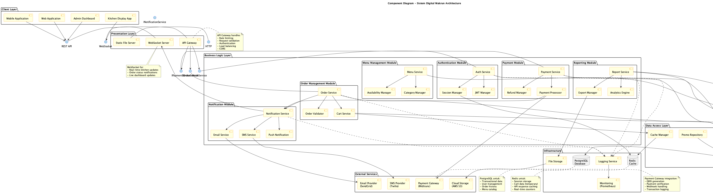

---

##### 4.3.1 High-Level Architecture

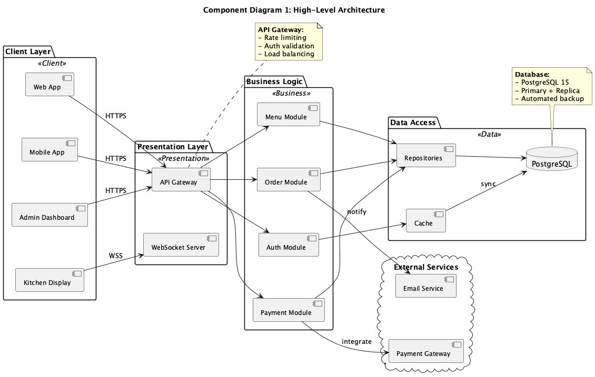

**Layers:**
1. **Client Layer:** Web App, Mobile App, Admin Dashboard
2. **Presentation:** API Gateway, WebSocket Server
3. **Business Logic:** Order, Payment, Menu, Auth modules
4. **Data Access:** Repositories, ORM, Cache
5. **External Services:** Payment Gateway, Email

**4-Tier Architecture** dengan clear separation of concerns

---

##### 4.3.2 Business Logic Detail

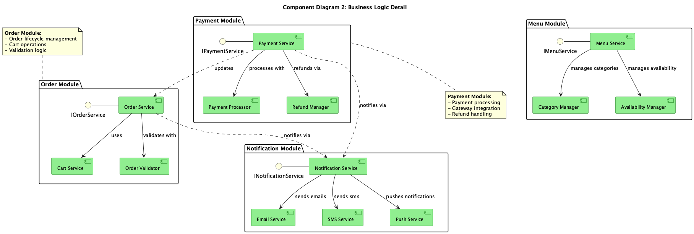

**Modules:**

**Order Module:**
- OrderService, CartService, OrderValidator

**Payment Module:**
- PaymentService, PaymentProcessor, RefundManager

**Menu Module:**
- MenuService, CategoryManager, AvailabilityManager

**Notification Module:**
- NotificationService, EmailService, SMSService, PushService

**Inter-module:** Service dependencies via interfaces

---

### 4.4 COMPOSITE STRUCTURE DIAGRAM

**Penanggung Jawab:**  
- Desainer: Umar Bakri  
- Reviewer: Vina Wati  
- Tanggal: 12 Desember 2025

#### Deskripsi
Composite Structure menunjukkan internal architecture dari OrderService component, dengan ports, parts, dan connectors.

#### Diagram
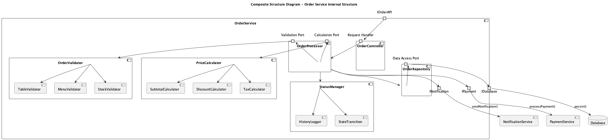

#### Internal Parts
- **OrderController:** Entry point, routing
- **OrderProcessor:** Business logic orchestration
- **OrderValidator:** Validation rules
- **PriceCalculator:** Price calculations
- **StatusManager:** State management
- **OrderRepository:** Data persistence

#### Ports
- `portin API`: Receives requests
- `portout Database`: Data access
- `portout Notification`: Send notifications
- `portout Payment`: Payment integration

---

### 4.5 PACKAGE DIAGRAM

**Penanggung Jawab:**  
- Desainer: Wahyu Nugroho  
- Reviewer: Xena Kartika  
- Tanggal: 12 Desember 2025

#### Diagram Overall


---

##### 4.5.1 Top-Level Organization

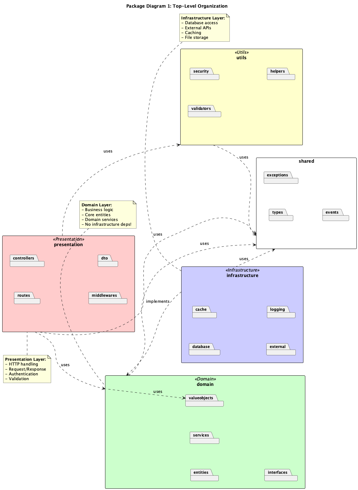

**Packages:**
- `presentation`: Controllers, routes, DTO
- `domain`: Entities, services, interfaces
- `infrastructure`: Database, cache, external
- `utils`: Security, validators, helpers
- `shared`: Types, exceptions, events

**Dependencies:** Presentation → Domain ← Infrastructure

---

##### 4.5.2 Domain Detail

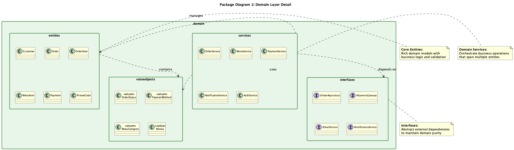

**Sub-packages:**
- `entities`: Customer, Order, MenuItem, Payment
- `services`: OrderService, PaymentService, MenuService
- `interfaces`: IOrderRepo, IPaymentGateway
- `valueobjects`: Money, OrderStatus, etc.

---

### 4.6 DEPLOYMENT DIAGRAM

**Penanggung Jawab:**  
- Desainer: Yudi Hartono  
- Reviewer: Zahra Amelia  
- Tanggal: 12 Desember 2025

#### Deskripsi
Deployment Diagram menggambarkan infrastructure fisik production environment.

#### Diagram
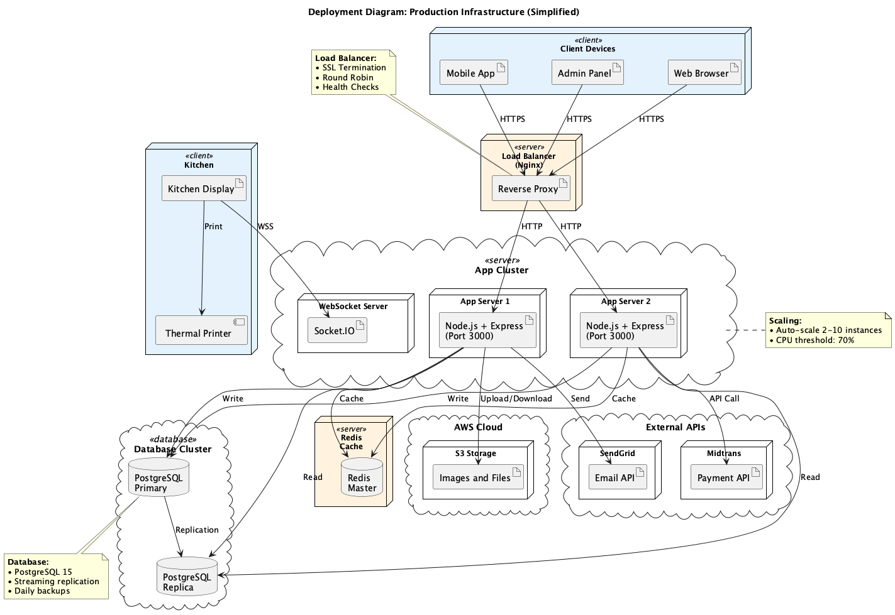

#### Infrastructure

**Client Tier:**
- Web Browser, Mobile App, Admin Panel, Kitchen Display

**Load Balancer:**
- Nginx (SSL termination, round-robin)

**Application Tier:**
- 2+ Node.js servers (auto-scale)
- WebSocket server (Socket.IO)

**Database Tier:**
- PostgreSQL Primary + Replica (streaming replication)

**Cache Tier:**
- Redis Master + Replica

**Storage:**
- AWS S3 (images, reports)
- CloudFront CDN

**External:**
- Midtrans Payment Gateway
- SendGrid Email Service

**Monitoring:**
- Prometheus, Grafana, ELK Stack

---

### 4.7 PROFILE DIAGRAM

**Penanggung Jawab:**  
- Desainer: Adinda Putri  
- Reviewer: Bagus Setiawan  
- Tanggal: 12 Desember 2025

#### Deskripsi
Profile Diagram mendefinisikan UML extensions untuk Food & Beverage domain.

#### Diagram
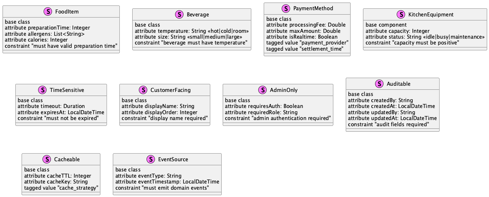

#### Stereotypes Defined

**<<FoodItem>>:**
- preparationTime: Integer
- allergens: List

**<<Beverage>>:**
- temperature: Enum  
- size: Enum

**<<PaymentMethod>>:**
- processingFee: Double
- maxAmount: Double

**<<TimeSensitive>>:**
- timeout: Duration
- expiresAt: DateTime

**<<Cacheable>>:**
- cacheTTL: Integer

**<<EventSource>>:**
- eventType: String

**Applications:**
- MenuItem <<FoodItem, CustomerFacing, Cacheable>>
- Order <<TimeSensitive, EventSource, Auditable>>
- Payment <<PaymentMethod, EventSource>>

---

## 5. KESIMPULAN

### 5.1 Ringkasan

Perancangan Sistem Digital Wakrun telah didokumentasikan secara komprehensif menggunakan 14 jenis diagram UML yang mencakup aspek behavioral dan structural.

**Diagram Behavioral (7):** Use Case, Activity, State Machine, Sequence, Communication, Timing, Interaction Overview

**Diagram Structural (7):** Class, Object, Component, Composite Structure, Package, Deployment, Profile

### 5.2 Dokumentasi yang Dihasilkan

- 30 diagram files (.puml)
- 30 diagram images (PNG)
- Laporan perancangan lengkap

### 5.3 Next Steps

1. **Review & Validation:** Tim review semua diagram
2. **Export Images:** Generate PNG dari semua .puml
3. **Implementation:** Mulai development berdasarkan design
4. **Testing:** Unit, integration, system testing
5. **Deployment:** Setup production infrastructure

---

## 6. APPENDIX

### 6.1 Daftar Diagram

**Total:** 30 diagram files, 14 types

| No | Diagram Type | Files | Penanggung Jawab |
|----|--------------|-------|------------------|
| 1 | Use Case | 1 | Ana Kusuma |
| 2 | Activity | 4 | Citra Dewi |
| 3 | State Machine | 1 | Eko Prasetyo |
| 4 | Sequence | 6 | Gita Maharani |
| 5 | Communication | 1 | Indra Gunawan |
| 6 | Timing | 1 | Kartika Sari |
| 7 | Class | 5 | Omar Faruq |
| 8 | Object | 1 | Qori Ananda |
| 9 | Component | 3 | Satria Buana |
| 10 | Composite | 1 | Umar Bakri |
| 11 | Package | 3 | Wahyu Nugroho |
| 12 | Deployment | 1 | Yudi Hartono |
| 13 | Interaction | 1 | Maya Puspita |
| 14 | Profile | 1 | Adinda Putri |

### 6.2 Referensi

- UML 2.5 Specification - OMG
- PlantUML Documentation
- Clean Architecture - Robert C. Martin
- Domain-Driven Design - Eric Evans

---

**Prepared by:** Tim Perancang Sistem Digital Wakrun  
**Date:** 12 Desember 2025  
**Version:** 1.0  
**Status:** Final
